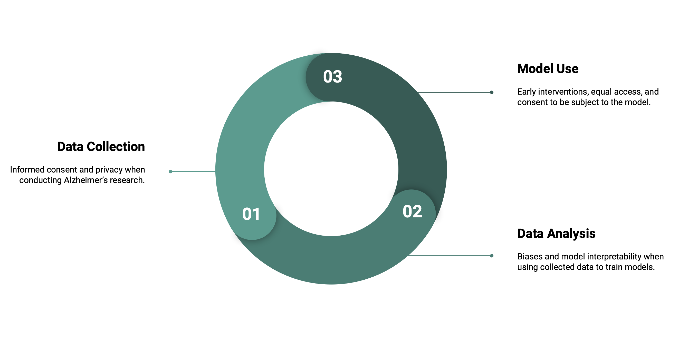

---
jupytext:
  formats: md:myst
  text_representation:
    extension: .md
    format_name: myst
    format_version: 0.13
    jupytext_version: 1.11.5
kernelspec:
  display_name: Python 3
  language: python
  name: python3
---

# Introduction

## Symptoms

Alzheimer’s disease (AD) is a progressive cognitive and neuropsychiatric disorder characterized by cognitive decline and impairment. Memory loss, impaired decision making, depression, apathy, and agitation are the most frequently observed symptoms. Delusions, hallucinations and aggression also present as the disease progresses to later stages (Miller et al., 2011). Mild cognitive impairment (MCI) is a stage that typically precedes AD that integers with daily living to a lesser degree than AD. AD patients typically progress from healthy, to MCI, and lastly to dementia over the course of 15 to 25 years (Scheltens et al., 2021). Duration of stages of AD are estimated to be 10 years of preclinical symptoms, 4 years of the MCI, and 6 years of dementia.

## Epidemiology

There are an estimated 50 million people with AD worldwide. This rate is expected to triple by 2050. Prevalence disproportionately affects low and middle-income countries, accounting for two-thirds of the affected population. Survival times range from 3 to 6 years post AD dementia diagnoses. Risk factors include advanced age (> 65 years), APOE epsilon 4 allele, women, and poor cardiovascular health (Scheltens et al., 2021).

## Neurophysiology & Structure

AD is characterized by structure and functional neural changes. Structure and histology is described by the accumulation of two proteins: amyloid plaques and neurofibrillary tangles (Bhat et al., 2015). Larger scale structural changes may be detected using structural magnetic resonance imaging (sMRI). Early atrophy, or neuronal cell death, has been observed in the entorhinal cortex, amygdala, hippocampus, parahippocampus, and posterior cingulate. Late atrophy is found in the temporal neocortex (Johnson et al., 2012).

Functional changes are consequent of synaptic deterioration, reflected in signals recorded by electroencephalogram (EEG) and functional MRI (fMRI). The fMRI literature describes task based disruptions, typically memory tasks, associated with AD. Implicated regions often reflect that of what is described in the sMRI literature. In contrast, resting state fMRI typically focuses on disruptions in common networks, specifically the default mode network (Johnson et al., 2012).

EEG findings of AD include a reduction in alpha (8-13 Hertz) wave amplitude (Tran et al., 2020), a sharpening of alpha waves, and a slowing of alpha waves (Bhat et al., 2015; Jafari et al., 2020). Alpha oscillations are thought to be associated with memory and attentional processes, and inhibition related to suppressing task-irrelevant brain regions. Reductions in gamma oscillation amplitude (30-200Hz) have also been found (Jafari et al., 2020).

## Specific Aims

The current effort is particularly focused on early detection of AD using EEG. Specific plans for this effort, and related ethical considerations, will be discussed for data collection, data analysis, and model use. Ethical concerns for data collection are consent and privacy, discussed in the following section. This is followed by a discussion of anticipated issues regarding biases and model interpretability in the data modeling section. The model use section discusses patient protections and model interpretations following deployment. The final two sections are related to justice and revision, respectively. These section broadly relate to maximining benefits and minizing harm. Lastly, there is a technical section that includes preliminary analyses.

*Figure 1. The following sections disscuss ethical concerns related to data collection, analysis, and use.*
