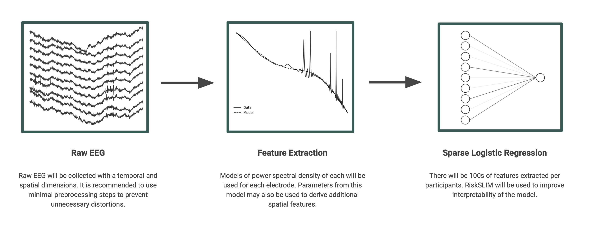

---
jupytext:
  formats: md:myst
  text_representation:
    extension: .md
    format_name: myst
    format_version: 0.13
    jupytext_version: 1.11.5
kernelspec:
  display_name: Python 3
  language: python
  name: python3
---

# Data Analysis

## Analysis Plan

Following the collection of raw EEG data, interpretable features will be extracted from the preclinical phase. This process requires computing power spectral density from the raw time series and extracting spectral model parameters. Spectral features will then be used to train a sparse logistic regression classification to predict probability of progression to MCI or dementia. Ethical concerns related to model interpretability and biased performance are discussed. Additional details and a preliminary analysis are presented in the technical section.

*Figure 3. Data analysis involves extracting interpretable features from raw EEG and training an AD risk model.*

## Interpretability

Models intended to be deployed in high risk settings, where there is the potential for significant harm from inaccurate prediction, benefit from interpretability. Interpretability refers to the ability to explain why a model made a decision or prediction. This is particularly important in healthcare (Ahmad et al., 2013) and the current context as doctors must have trust in a model’s predictions prior to starting treatments or regimes for protecting against AD. Black box models, such as deep neural networks, can provide high accuracy but low interpretability. These models do not have clear mappings from inputs to predicted outputs. In many cases, interpretable models may result in reduced performance. In these cases, post-hoc explainability methods of black box models have been proposed.

Designing interpretable models requires a combination of feature selection aided from domain expertise and the use of simple linear models. These models will be first attempted prior to increasing model complexity or relying on post-hoc explainability methods. Specifically, a risk calibrated super sparse linear integer model (RiskSLIM; Ustun & Rudin, 2016) will be used to achieve interpretability. These models are sparse and include feature selection in the optimization problem, constrain logistic regression coefficients to integer values, and provide risk or probability estimates.

## Biases

Biases may be present during training if a diverse sample is not collected initially or the model is not trained to balance accuracy across groups of interest. This is related to the idea of fairness, or equal distributions of harms and benefits. Examples of this bias include poor performance on specific sub-groups related to race or sex. This may later lead to harm of the affected sub-group when the model is deployed. One meta analysis found that 67% of publications in machine learning and health care literature contained racial bias (Huang et al., 2022).

To prevent sub-group biases during data analysis, bias will first be examined following model training. This requires the identification of groups of interest, likely to be race, sex, and socioeconomic status, but additional groups may be added depending on the demographics of participants. Once these groups are determined, a penalty may be added to the loss function that scales with the max minus min performance metric between groups. If all groups have equal performance (e.g. area under the curve), the penalty would be zero. As performance difference between sub-groups increases, the loss would increase to promote fair optimization.
