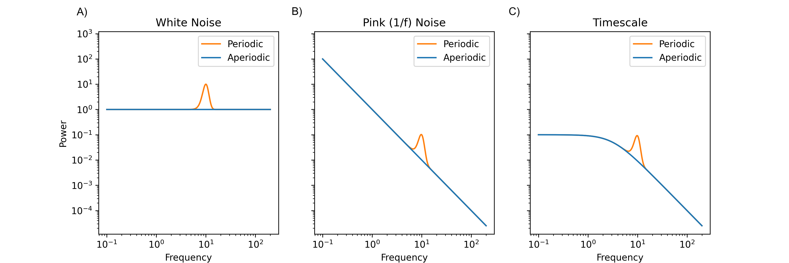

---
jupytext:
  formats: md:myst
  text_representation:
    extension: .md
    format_name: myst
    format_version: 0.13
    jupytext_version: 1.11.5
kernelspec:
  display_name: Python 3
  language: python
  name: python3
---

# Technical Details

## Background

Fourier analysis is typically applied to EEG, decomposing signals into power across frequencies, namely power spectral density (PSD; Fig. 7). These spectra can broadly be broken into aperiodic, or stochastic processes (blue), and periodic, oscillatory, or wave-like processes (orange). Aperiodic processes typically appear more random in the time domain and span across all frequencies in PSD, whereas oscillatory features appear as (non-)sinusoidal waves in time and are typically narrow-band limited in PSD (e.g. power concentrated in a limited frequency range).

  *Figure 7. Simulated power spectral density of a) white noise, b) 1/f or pink noise, and c) a timescale process (blue). Oscillations were modeld as a 10 hertz sinusoidal oscillation (orange).*

Periodic changes associated with AD include a reduction in alpha (8-13 Hertz) wave amplitude (Tran et al., 2020), a sharpening of alpha waves, and a slowing of alpha waves (Bhat et al., 2015; Jafari et al., 2020). Alpha oscillations are thought to be associated with memory and attentional processes, and inhibition related to suppressing task-irrelevant brain regions. Reductions in gamma oscillation amplitude (30-200Hz) have also been found (Jafari et al., 2020).

Aperiodic changes associated with AD include increased (Tran et al., 2020) slope of 1/f (Fig. 7a;). This is aligned with the observation of general increases in delta (0.5 to 4 Hz) and theta (4 to 7 Hz) (Jafari et al., 2020). Some studies note an increase in theta oscillations (e.g. periodic; Stomrud et al., 2010), however, these studies do not disentangle periodic and aperiodic activity leading to possible conflation (Donoghue et al., 2020). This conflation emphasizes the importance of parameterizing aperiodic and periodic processes separately. Another study used multiscale entropy features (e.g. timescales; Fig. 7c blue) and found long timescales were associated with AD (Yang et al., 2013).

Support vector machines have been used to successfully (AUC=0.8) classify AD patients and healthy controls using spectral features derived from electrode pairs (Trambaiolli et al., 2011). A separate study found that modeling pairwise connectivity or synchrony in the theta band produced optimal classification accuracy (Gallego-Jutglà et al., 2012). One study specifically examined aperiodic features, using fractality features (e.g. 1/f slope; Fig. 7b blue) to almost perfectly classify AD. Another 1/f study found reasonable classification performance (AUC=0.8) using 1/f slopes (Fig. 7b, blue) features (Vyšata et al., 2013). Predictive modeling in AD is complicated by high dimensional data leading to a lack of interpretability and by the progressive nature of AD.

## Preliminary Analysis

Data used in the preliminary analysis uses open source resting state, scalp EEG data from 88 participants (Miltiadous et al., 2023). This includes patients with AD, frontaltemporal dementia, or healthy controls. This dataset is freely available from [openneuro](https://openneuro.org/datasets/ds004504/versions/1.0.5). The preliminiary analyses extracted timescales from PSD across electrodes for each participant. Low frequencies were fit linearly (e.g. Fig. 7a) and high frequency were fit with a double timescales model (e.g. Fig. 7c). Theses features were then used to train a risk-calibrated supersparse linear integer model (RiskSLIM; Ustun & Rudin, 2016).

